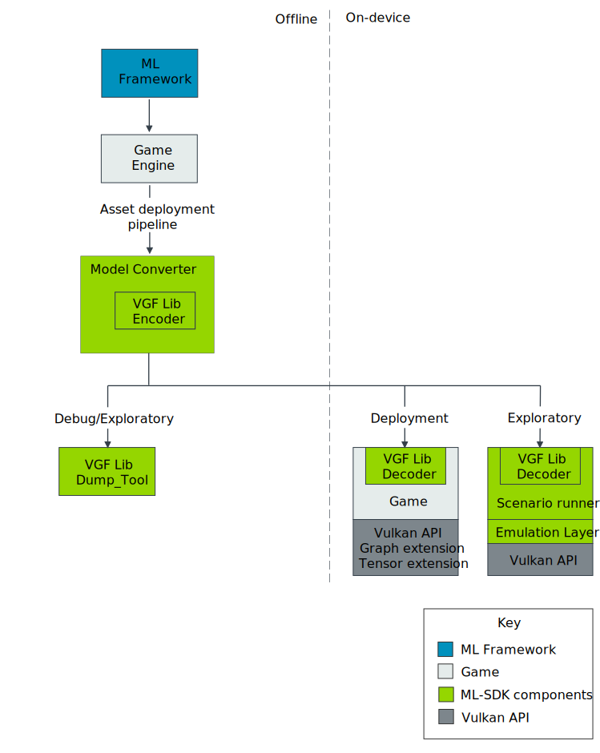

Introduction
============

The |SDK_project| is a collection of libraries and tools consisting of various components:

• :ref:`ML SDK Model Converter`
• :ref:`ML SDK VGF Library`
• :ref:`ML SDK Scenario Runner`
• :ref:`ML Emulation Layer for Vulkan®`

The following figure shows how you can use each of the ML SDK for Vulkan® components in a larger system:

The following gives a brief introduction to each of the ML SDK for Vulkan® components:

**Model Converter**
    Converts TOSA models into SPIR-V™ graphs and packages the whole use case into a
    VGF file. The Model Converter must be used as part of an asset pipeline
    deployment flow and is separated into two stages:

    1. The framework specific conversion mechanism lowers the framework model to a TOSA intermediate representation
    (not part of the |SDK_project|).

    2. The Model Converter applies additional transforms and optimizations before lowering to SPIR-V™ graph
    intermediate representation (IR) and then packaging the use case into a :code:`.vgf` file.

**VGF Library**
    A simple, efficient container format for ML use cases consisting of SPIR-V™ graphs, custom shaders,
    and constant data. This component provides:

    - A C++ encoder and decoder API for writing and efficiently reading VGF files.
    - A C decoder wrapper API to provide stable ABI bindings.
    - A VGF Dump Tool for working with VGF files.

    The VGF Library is intended for integration into game engines. The library has been designed around
    efficient decoding of the VGF file at runtime by supporting memory mapped file access (optional). The
    library requires user managed memory allocation to minimise copying and in-memory duplication of
    potentially large constant data.

**Scenario Runner**
    A data driven test and validation tool for executing ML workloads described in
    JSON scenario files.

**Emulation layer**
    A TOSA compliant, compute-based implementation of the graph and tensor extensions which is exposed
    using Vulkan® Layers.

In addition to these components, you will find documentation, tutorials, samples, and tests.

Production
----------

The proposed production workflow involves integrating the ML SDK Model Converter into the
application or game :code:`asset deployment pipeline`. The pipeline needs a TOSA intermediate
representation of a framework specific native model file. To obtain a TOSA intermediate
representation, you should use a specific framework to TOSA converter (not depicted here).

The TOSA intermediate representation is then passed to the ML SDK Model Converter
to produce a :code:`.vgf` file. The VGF file contents can then be:

• Embedded into the game or application's native packaging format.
• Distributed as a file on disk as part of the normal platform specific application deployment flow.

.. tip::
    When exploring the API, a tight integration is not necessary because the Model Converter can work directly
    with the framework files. The ML SDK Scenario Runner can also parse the VGF file directly. We recommend
    passing the TOSA intermediate representation to the ML SDK Model Converter for smoother Model Authoring
    workflows when in production.

The application or game component that runs on the device, must integrate the
:code:`ML SDK VGF Library decoder` library to parse the VGF file contents so that the application or
game code can set up the required Vulkan® state.

.. note::
    The ML SDK VGF Library does not make any calls into the Vulkan® API. The integration must translate the parsed
    information directly into Vulkan® API calls, for example, allocating memory and creating resources,
    pipelines, synchronisation, and session objects.

Exploration
-----------

When exploring the viability of a ML use case or API integration, it can be useful to first explore the use
case for the ML SDK Scenario Runner. The ML SDK Scenario Runner allows running use cases in a declarative manner before
working on more complicated feature integrations.

.. tip::
    While the API is relatively new, we recommend you use the ML SDK Emulation Layer for Vulkan® for exploration. The Emulation Layer
    provides a TOSA conformant software implementation of the Vulkan® graph and tensor extensions. The Emulation
    Layer is enabled by the Vulkan® Layer mechanism.

    Another useful tool for exploration and debugging is the VGF Dump Tool. The VGF Dump Tool allows a developer
    to extract specific elements of the VGF file or even generate a template scenario description for a VGF file.

Platforms
---------

This table represents the status of platform support. We will increase support in the upcoming releases.

+------------------+-----------+----------+----------+-----------+
| Platforms        | ML SDK    |  ML SDK  | ML SDK   | ML SDK    |
|                  | Model     |  VGF     | Scenario | Emulation |
|                  | Converter |  Library | Runner   | Layer     |
+========+=========+===========+==========+==========+===========+
| Linux  | AArch64 | |/|       | |/|      | |/|      | |/|       |
+        +---------+-----------+----------+----------+-----------+
|        | X86-64  | |/|       | |/|      | |/|      | |/|       |
+--------+---------+-----------+----------+----------+-----------+
| Windows| AArch64 | |x|       | |x|      | |x|      | |x|       |
+        +---------+-----------+----------+----------+-----------+
|        | X86-64  | |/|       | |/|      | |/|      | |/|       |
+--------+---------+-----------+----------+----------+-----------+
| MacOS  | AArch64 | |x|       | |x|      | |-|      | |-|       |
+        +---------+-----------+----------+----------+-----------+
|        | X86-64  | |x|       | |x|      | |-|      | |-|       |
+--------+---------+-----------+----------+----------+-----------+
| Android| AArch64 | |-|       | |/|      | |/|      | |/|       |
+        +---------+-----------+----------+----------+-----------+
|        | X86-64  | |-|       | |x|      | |x|      | |x|       |
+--------+---------+-----------+----------+----------+-----------+
