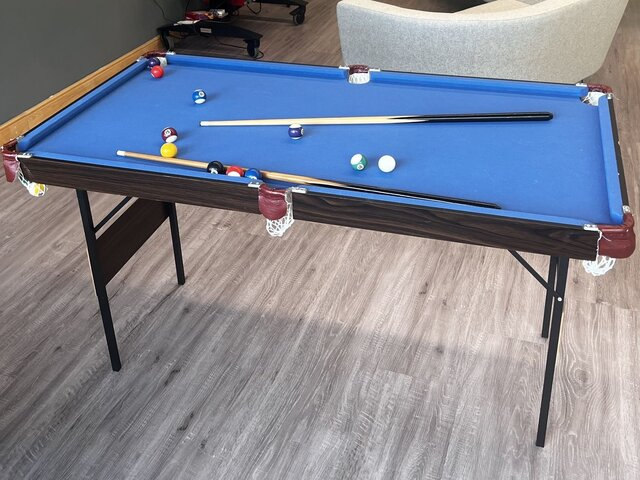
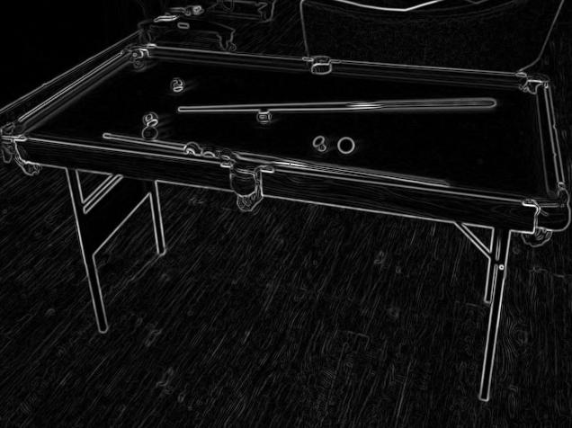

Tensor aliasing tutorial
========================

This tutorial builds on the previous :ref:`Converting and deploying a PyTorch model tutorial`
and describes tensor aliasing by showing how to implement edge detection with Sobel filtering. This
tutorial also demonstrates how to implement image filtering using tensor operations.

1. The ML SDK Scenario Runner accepts an image in DDS format instead of common
image formats such as  :code:`.jpg`  or  :code:`.png`. To convert a  :code:`.jpg`  or
:code:`.png` image to DDS format, use the :code:`save_image_to_dds.py` script below.

.. literalinclude:: assets/save_image_to_dds.py
    :language: python

The script requires 3 arguments:

    a. The path to the binary program called dds_utils, which is built as part of the ML SDK Scenario Runner.

    b. The input image, for example, :code:`PoolTable.jpg`.

    c. The output image name, for example, :code:`PoolTable.dds`.

To use the :code:`dds_utils` tool from ML SDK Scenario Runner to generate the file, run:

.. code-block:: bash

    python save_image_to_dds.py \
        dds_utils \
        PoolTable.jpg \
        PoolTable.dds

The script generates a :code:`PoolTable.dds` file ready for use by the ML SDK Scenario Runner.

2. To create the model in Pytorch, and use ExecuTorch to convert it to TOSA FlatBuffers, run following :code:`SobelFiltering.py`:

.. literalinclude:: assets/SobelFiltering.py
    :language: python

.. code-block:: bash

    python SobelFiltering.py

This generates a TOSA Flatbuffers :code:`${NAME}.tosa`, where :code:`${NAME}` is generated by the tool.

.. note::
    :code:`image_height` and :code:`image_width` parameters are hard-coded in this script
    based on the input image in the previous step.

3. Use the TOSA FlatBuffers file to generate the VGF file and Scenario Template:

.. code-block:: bash

    model-converter --input ${NAME}.tosa --output sobel_filtering.vgf

.. code-block:: bash

    vgf_dump --input sobel_filtering.vgf --output scenario.json --scenario-template

.. note::
    For more information about these commands, see the
    :ref:`Converting and deploying a PyTorch model tutorial`.

4. Modify the Scenario Template:

    a. Add a section under resources before the section for :code:`input_0_ref` tensor resource to include
       the image input you want to use:

    .. code-block:: json

        {
            "image": {
                "dims": [
                    1,
                    640,
                    480,
                    1
                ],
                "format": "VK_FORMAT_R32G32B32A32_SFLOAT",
                "shader_access": "readonly",
                "src":"PoolTable.dds",
                "uid": "input_image"
            }
        }

    b. Replace the :code:`src` entry in :code:`input_0_ref` tensor resource with tensor alias to :code:`input_image`. The resource description
       of this tensor resource should look like this afterwards:

    .. code-block:: json

        {
            "tensor": {
                "dims": [
                    1,
                    480,
                    640,
                    4
                ],
                "format": "VK_FORMAT_R32_SFLOAT",
                "shader_access": "readonly",
                "alias_target": {
                    "resource_ref": "input_image"
                },
                "uid": "input_0_ref"
            }
        }

    c. Replace :code:`TEMPLATE_PATH_TENSOR_OUTPUT_0` with :code:`output.npy`.

5. Use the ML SDK Scenario Runner to run the scenario:

.. code-block:: bash

    scenario-runner --scenario scenario.json

6. Run the following code to convert the result into a  :code:`.jpg`  image:

.. literalinclude:: assets/save_npy_to_image.py
    :language: python
